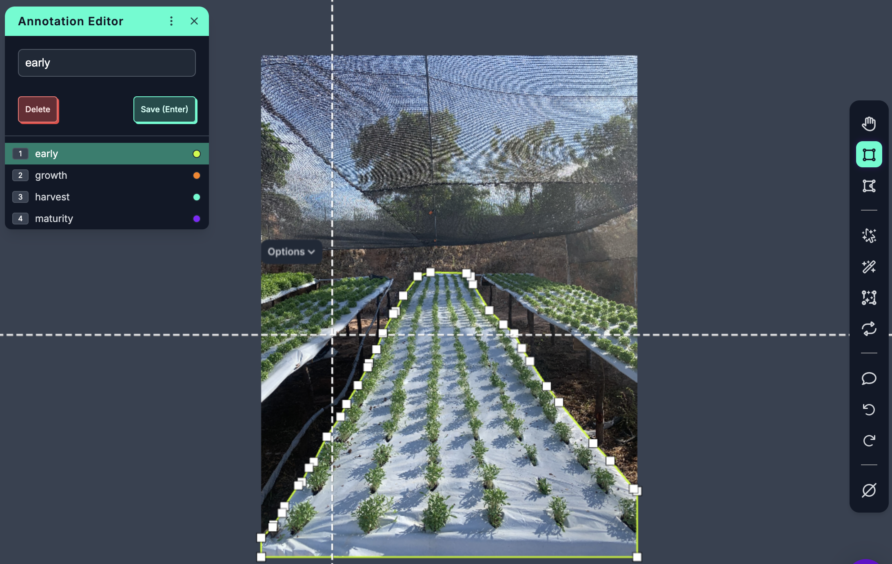
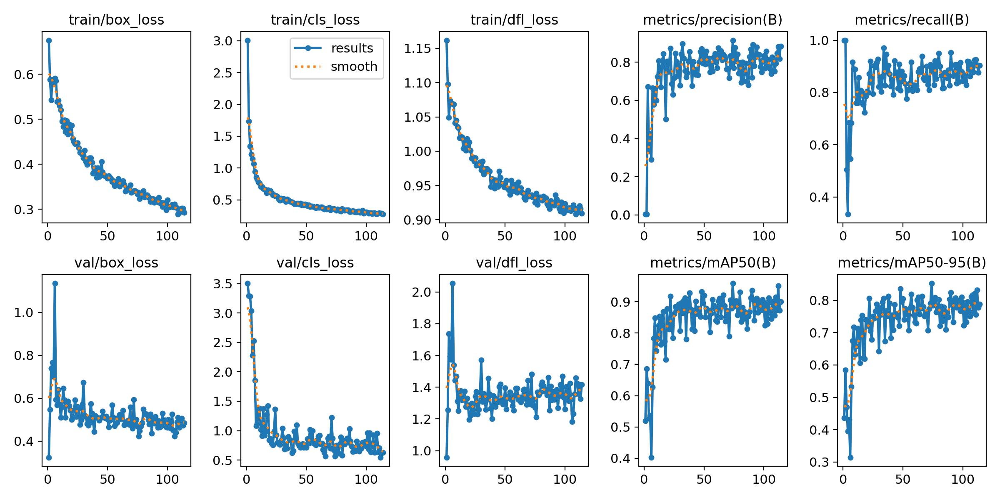
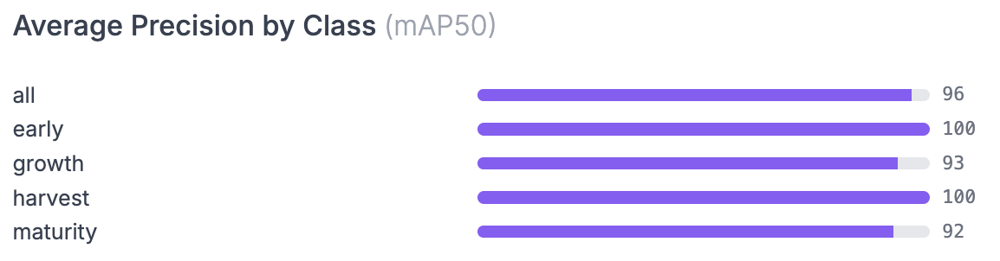
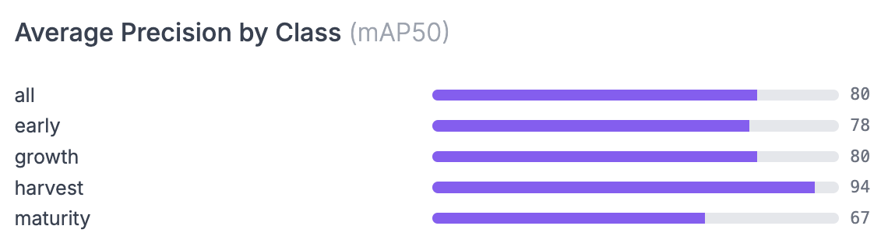
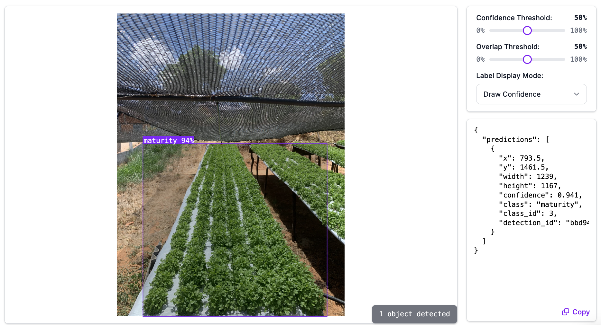

# Hydroponic Development Stage Classifier

We created a classification solution to identify hydroponic crop development stages using the Roboflow platform.

## Project Goal

The goal is to remotely monitor the development stages of hydroponic farming systems in Brazil's northeastern semi-arid region, aiming to increase productivity and sustainability in dry areas.

The development stages considered are:
- **Early**: Initial stage.
- **Growth**: Vegetative growth.
- **Maturity**: Fully developed stage.
- **Harvest**: Ready for harvest.

---

## Dataset

### Dataset Details
- **Total Images**: 1,147 (including augmented data)
- **Train Set**: 1,076 images (94%)
- **Validation Set**: 48 images (4%)
- **Test Set**: 23 images (2%)

### Accessing the Dataset
The dataset is hosted on Google Drive and includes the original and augmented versions:

1. **Original Data**:
   - Download from [Google Drive - Original Data](https://drive.google.com/drive/folders/1n6uep0UZztH4hrME0ri1NfhDuk6vCfVq)
   - Contains the raw images taken from each crop.

2. **Augmented Data**:
   - Download from [Google Drive - Augmented Data](https://drive.google.com/drive/folders/1fuf_kWXcjVw2eKkiKvcZHyFeHq2vC6PN)
   - Includes the augmented images and corresponding annotations annotations in COCO JSON format.

### Using the Dataset
1. Download both datasets from the links above.
2. Unzip the folders and organize the files into a local directory.
3. Use the `coco_annotations.json` file in the augmented data folder for training, validation, and testing.

---

## Annotation Instructions

1. **Annotation Process**:
   - Use a polygon annotation tool to outline the hydroponic crops in each image.



   - Assign one of the following classes to each region:
     - `early` (Early stage)
     - `growth` (Growth stage)
     - `maturity` (Mature stage)
     - `harvest` (Ready for harvest)

3. **Preprocessing**:
   - Images are resized to 640x640 pixels for training.
   - Brightness adjustments are applied randomly between -15% and +15%.

---

## Model Training and Evaluation

The YOLOv11 model was trained using the Roboflow interface. Below are the metrics and graphs from training, validation, and testing:

### Model Metrics:
- **mAP (Mean Average Precision)**: **96.0%**
- **Precision**: **91.4%**
- **Recall**: **88.1%**

### Performance Graphs:
- **mAP over Epochs**:
  
- **Training Graphs**:
  
- **mAP over class - Validation Set**:
  
- **mAP over class - Test Set**:
  

---

## How to Reproduce

Follow these steps to use the dataset and retrain the model on the **Roboflow platform**:

1. **Access the Dataset**
   Download the dataset from the links provided in the [Dataset](#dataset) section.

2. **Create a Roboflow Project**  
   - Sign up at [Roboflow](https://roboflow.com/) and create a new **Object Detection project**.
   - Upload the dataset (images and `coco_annotations.json`).

3. **Configure Dataset**  
   - Split the dataset into training, validation, and testing sets.
   - Apply preprocessing (resize to 640x640) and augmentations (e.g., brightness adjustments).

4. **Train the Model**  
   - Use Roboflow's built-in **Train** tab to train a YOLOv11 model.
   - Monitor metrics like mAP, Precision, and Recall.

5. **Evaluate and Deploy**  
   - Analyze results using metrics, graphs, and predictions.
   - Deploy the model via API or download it for local use.

---

## Results

**Sample Prediction**:


---

## Future Improvements
- **IoT Integration**: Automate the collection of images using IoT-enabled cameras.
- **Anomaly Detection**: Develop unsupervised learning pipelines to detect anomalies in crop growth.
- **Real-Time Monitoring**: Implement real-time predictions for on-site decision-making.

---

## License
This project is licensed under the [MIT License](LICENSE).

## Contributors
- **Carolina Bez**: Head of Data Analytics.
- **Klaus Egewarth**: Agricultural Engineer.
- **Otniel Amorim**: Product Manager.

---

### References
- [AI4GOOD](https://ai4good.org/)
```
